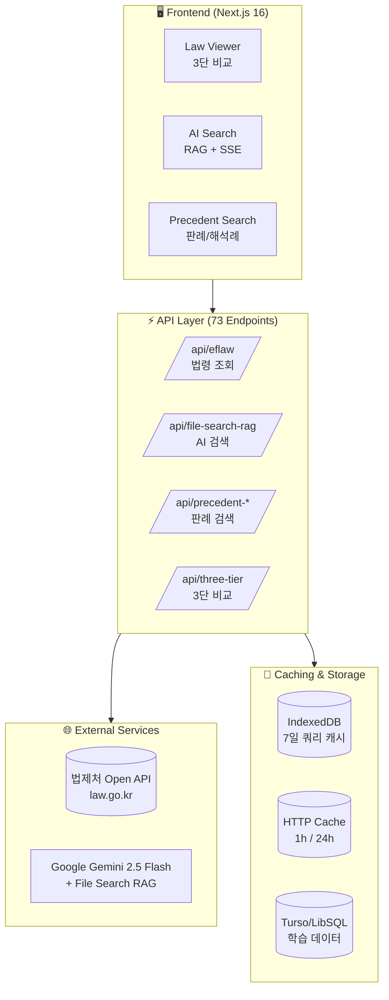
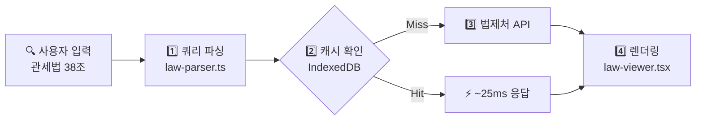
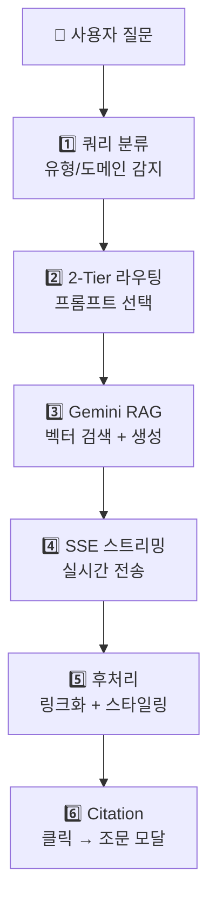

# LexDiff

### 한국 법령 · 조례 · 판례 통합 분석 플랫폼

국가법령부터 지방자치단체 조례까지, 신·구법 대조, 위임법령 3단 비교, AI 자연어 검색, 판례·해석례 통합 검색을 한 곳에서.
**관세사·세무사·변호사·공무원을 위한 올인원 법령 분석 도구**


---

## 🎯 LexDiff가 해결하는 문제

### 🏛️ 공무원·지자체 담당자
| 기존 방식 | LexDiff |
|-----------|---------|
| 국가법령정보센터 + 자치법규정보시스템 따로 검색 | **국가법령 + 조례/규칙 통합 검색** |
| 상위법령-조례 관계 파악에 시간 소모 | **법률 → 시행령 → 조례 위임 관계 3단 비교** |
| 조례 개정 시 상위법 변경사항 일일이 확인 | **신·구법 대조 + AI 변경 요약** |
| 유사 조례 검색은 각 지자체별 수동 확인 | **전국 자치법규 키워드 검색** |

### 📦 관세사·무역 전문가
| 기존 방식 | LexDiff |
|-----------|---------|
| 관세법-시행령-시행규칙 탭 왔다갔다 | **3단 위임법령 비교로 한 화면에** |
| "HS코드 분류 기준이 뭐지?" → 조문 하나씩 읽기 | **AI가 자연어 답변 + 근거 조문 자동 인용** |
| 관세청 법령해석 별도 검색 | **법령 뷰어에서 관세청 해석례 바로 확인** |
| FTA 특혜관세 요건 확인에 여러 고시 참조 | **조문별 관련 행정규칙(고시/훈령) 자동 연결** |

### ⚖️ 세무사·변호사
| 기존 방식 | LexDiff |
|-----------|---------|
| 세법 개정 영향 분석에 신·구법 PDF 비교 | **실시간 변경점 하이라이팅 + AI 요약** |
| 판례·심판례 별도 사이트 검색 | **조세심판원 재결례 + 대법원 판례 통합** |
| 법령해석례 찾기 어려움 | **법제처 해석례 검색 + 조문 연동** |

---

## ✨ 핵심 기능

### 🔍 AI 자연어 검색
> "청년 창업 지원 요건은?" → AI가 관련 법령을 분석해 즉시 답변

- **Google Gemini 2.5 Flash + File Search RAG** 기반
- 실시간 스트리밍 답변 (타이핑 효과)
- **모든 인용 출처를 클릭 가능한 링크로 변환** — 클릭하면 해당 조문 모달
- 2-Tier 라우팅: 질문 유형(정의/요건/절차/비교)별 최적화된 AI 프롬프트

### ⚖️ 3단 위임법령 비교
> 법률 → 시행령 → 시행규칙의 위임 관계를 한눈에

- **1단 뷰**: 법률 본문
- **2단 뷰**: 법률 + 시행령 좌우 비교
- **3단 뷰**: 법률 + 시행령 + 시행규칙 3열 비교
- 각 열 독립 스크롤, 위임 조문 자동 하이라이팅

### 📋 신·구법 대조
> 개정 전후를 한눈에 비교

- 변경사항 컬러 하이라이팅 (추가/삭제/수정)
- AI 변경 요약: 핵심 변경점 3-5개 자동 추출
- 시행일·공포일·제개정구분 메타데이터 표시

### 📚 판례·해석례 통합 검색
> 조문을 보면서 관련 판례를 바로 확인

- **대법원/하급심 판례** — 판시사항·요지·전문 조회
- **법령해석례** — 법제처 해석 사례
- **조세심판원 재결례** — 조세 분쟁 재결
- **관세청 법령해석** — 관세 분야 해석 사례
- 법령 뷰어 하단에 관련 판례 자동 표시

### 📑 행정규칙 연동
> "이 조문 관련 고시·훈령 뭐가 있지?"

- 조문별 관련 행정규칙(훈령/예규/고시) 자동 검색
- Optimistic UI: 캐시 데이터 즉시 표시 + 백그라운드 갱신

### 🏘️ 자치법규 (조례/규칙) 검색
> 전국 지방자치단체의 조례와 규칙을 한 곳에서

- **17개 시·도 + 226개 시·군·구** 자치법규 통합 검색
- 조례 본문 조회 및 조문별 탐색
- 국가법령과 동일한 UI/UX로 일관된 사용 경험
- 상위법령(법률/시행령) → 조례 위임 관계 추적

### 🕐 구법령 조회
> 과거 특정 시점의 법령 조회

- 시행일 기준 과거 법령 원문 조회
- 개정 이력 추적

---

## 🏗️ 시스템 아키텍처



---

## 🔬 기술 Deep Dive

### 법령 조회 파이프라인



| 단계 | 처리 내용 |
|------|-----------|
| **쿼리 파싱** | `"관세법 38조"` → `{ lawName: "관세법", jo: "003800" }` (JO 6자리 정규화) |
| **캐시** | IndexedDB 7일 TTL, 히트 시 ~25ms |
| **API 호출** | `/api/law-search` (XML) → `/api/eflaw` (JSON) → `/api/three-tier` (위임법령) |
| **렌더링** | 조문 트리 + 개정 마커 스타일링 + 법령 참조 자동 링크화 |

**핵심 특징:**
- **유사도 매칭**: 레벤슈타인 거리 (85%/60% 적응형 임계값)
- **통합 링크 시스템**: `관세법 제38조`, `같은 법 시행령` → 클릭 가능한 링크

---

### AI RAG 시스템 아키텍처



| 단계 | 처리 내용 |
|------|-----------|
| **쿼리 분류** | 질문 유형 (definition/requirement/procedure) + 도메인 (customs/tax) 감지 |
| **2-Tier 라우팅** | Tier 1: 법률 질문 → 전문 프롬프트 / Tier 2: 일반 질문 → 간결 프롬프트 |
| **Gemini RAG** | 법령 벡터 스토어 검색 → Gemini 2.5 Flash 컨텍스트 기반 답변 |
| **SSE 스트리밍** | 실시간 청크 전송 + Citation 메타데이터 (⚠️ 버퍼 잔여 처리 필수) |
| **후처리** | 마크다운→HTML + 법령 참조 링크화 + 섹션 스타일링 |
| **Citation** | 인용 클릭 → 모달 표시, 히스토리 스택으로 뒤로가기 지원 |

**성능 최적화:**
- **Exponential Backoff**: 429/5xx → 1초→2초→4초→8초 재시도 (±20% Jitter)
- **캐싱**: AI 결과 IndexedDB 저장 → 뒤로가기 즉시 복원

---

## 🛡️ 엔터프라이즈급 안정성

| 영역 | 구현 내용 |
|------|-----------|
| **테스트** | 667개 테스트 케이스 (Vitest) — JO코드 파싱, API 검증, AI 답변 처리, Rate Limiting |
| **보안** | Rate Limiting (100req/min), AI 일일 쿼터 (100회), Zod 입력 검증, XSS 방지, 보안 헤더 |
| **성능** | Optimistic UI, IndexedDB 캐싱, Exponential Backoff 재시도, React Virtual 가상화 |
| **CI/CD** | GitHub Actions — PR/Push 시 자동 테스트·타입체크·빌드 |

---

## 🚀 빠른 시작

### 요구 사항
- Node.js 20+
- pnpm (권장) 또는 npm

### 설치

```bash
# 저장소 클론
git clone https://github.com/your-repo/lexdiff.git
cd lexdiff

# 의존성 설치
pnpm install

# 환경 변수 설정
cp .env.local.example .env.local
```

`.env.local` 파일 편집:
```env
LAW_OC=법제처_API_키
GEMINI_API_KEY=Google_Gemini_API_키
```

### 실행

```bash
# 개발 서버
pnpm dev

# 테스트
pnpm test:run

# 빌드
pnpm build
```

브라우저에서 `http://localhost:3000` 접속

---

## 📊 기술 스택

| 영역 | 기술 |
|------|------|
| **Framework** | Next.js 16, React 19, TypeScript 5 |
| **UI** | Tailwind CSS v4, shadcn/ui, Radix UI, hugeicons |
| **AI** | Google Gemini 2.5 Flash, File Search RAG, SSE Streaming |
| **Data** | 법제처 Open API (73개 엔드포인트), Turso/LibSQL |
| **Caching** | IndexedDB (7일 쿼리 캐시, 영구 행정규칙), HTTP Cache |
| **Testing** | Vitest, Testing Library (667개 테스트) |
| **Security** | Rate Limiting, Zod Validation, CSP Headers |

---

## 📁 프로젝트 구조

```
app/
├── page.tsx                    # 메인 페이지
├── api/                        # 73개 API 라우트
│   ├── file-search-rag/        # AI RAG (SSE 스트리밍)
│   ├── eflaw/                  # 법령 조회
│   ├── precedent-*/            # 판례 검색/조회
│   ├── interpretation-*/       # 해석례 검색/조회
│   └── three-tier/             # 3단 비교
components/
├── law-viewer.tsx              # 메인 법령 뷰어 (오케스트레이터)
├── law-viewer/                 # 분리된 하위 컴포넌트
├── precedent-section.tsx       # 판례 섹션
├── reference-modal.tsx         # 법령 참조 모달
└── comparison-modal.tsx        # 신·구법 비교 모달
lib/
├── unified-link-generator.ts   # 법령 링크 생성 시스템
├── file-search-client.ts       # AI 클라이언트
├── law-parser.ts               # JO 코드 파서
└── precedent-parser.ts         # 판례 파서
hooks/
├── use-law-viewer-*.ts         # 법령 뷰어 훅
└── use-precedents.ts           # 판례 데이터 훅
```

---

## 📈 최근 업데이트

### v2.0 (2025-12)
- **law-viewer 대규모 리팩토링**: 1,820줄 → 1,189줄 (35% 감소)
- **판례/해석례 API 9개 추가**: 판례·해석례·조세심판원·관세청 검색
- **구법령 조회**: 과거 시점 법령 조회 지원
- **테스트 667개**: 테스트 커버리지 2배 이상 확대

### v1.0 (2025-11)
- AI 자연어 검색 (Gemini 2.5 Flash + File Search RAG)
- 3단 위임법령 비교 시스템
- 행정규칙 자동 연동
- Optimistic UI 패턴

---

## 📄 라이선스

MIT License

---

**LexDiff** — 법령 분석의 새로운 기준
