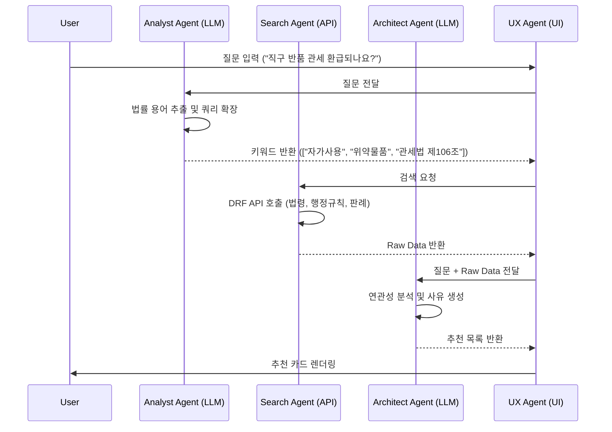

# AI 법령 네비게이터 (Legal Pathfinder) 개발 계획

## 1. 개요: BMad 방법론 기반 접근
본 프로젝트는 **BMad 방법론(Breakthrough Method for Agile AI Driven Development)**의 철학을 적용하여 개발됩니다. 단순한 기능 구현이 아닌, **Agentic Planning(에이전트 기반 기획)**과 **Context-Engineered Development(맥락 기반 개발)**의 2단계 접근법을 따릅니다.

**AI 법령 네비게이터**는 사용자의 자연어 질문에 대해 직접적인 답변을 제공하는 것을 넘어, 관련된 법령, 조문, 판례, 행정규칙 등을 찾아 추천해주는 **"역RAG(Reverse RAG)"** 기반의 탐색 서비스입니다.

이 기능은 별도의 테스트 페이지(`app/lab/navigator/page.tsx`)에서 독립적으로 개발 및 검증 후, 메인 서비스에 통합합니다. 로컬 인덱싱 없이 **100% 웹 기반(실시간 API + LLM)**으로 구현합니다.

---

## 2. Agentic Planning: 역할 정의 및 워크플로우

BMad 방법론에 따라 각 AI 에이전트(LLM)의 역할을 명확히 정의하고 협업 구조를 설계합니다.

### 2.1 에이전트 역할 (Roles)
1.  **Analyst Agent (Query Expander)**:
    *   **임무**: 사용자의 모호한 자연어 질문을 법률 검색에 최적화된 키워드와 의도(Intent)로 변환합니다.
    *   **Output**: `SearchQuery` 객체 (키워드 리스트, 검색 대상, 의도 분류)
2.  **Search Agent (API Wrapper)**:
    *   **임무**: Analyst가 생성한 쿼리를 바탕으로 외부 API(국가법령정보센터 DRF)를 실행하고 Raw Data를 수집합니다.
    *   **Output**: `RawSearchResult` 리스트
3.  **Architect Agent (Reranker & Reasoner)**:
    *   **임무**: 수집된 Raw Data와 사용자 질문을 대조하여 연관성을 평가(Scoring)하고, 추천 사유(Reasoning)를 작성합니다.
    *   **Output**: `RecommendedItem` 리스트 (정렬됨, 사유 포함)
4.  **UX Agent (Frontend)**:
    *   **임무**: 최종 결과를 사용자에게 직관적인 카드 UI로 제시하고, 3단 뷰어와의 연결(Deep Link)을 담당합니다.

### 2.2 워크플로우 (Workflow)


---

## 3. Context-Engineered Development: 상세 구현 계획

각 단계는 개발자(Dev Agent)가 문맥 손실 없이 구현할 수 있도록 상세히 기술됩니다.

### Phase 1: Foundation & Search Engine (Day 1)
*   **Context**: 사용자의 질문을 받아 API를 찌를 수 있는 기본 구조를 만듭니다.
*   **Tasks**:
    1.  **Test Page**: `app/lab/navigator/page.tsx` 생성.
    2.  **Search API**: `app/api/navigator/search/route.ts`
        *   `lawSearch.do` 래퍼 구현.
        *   Target: `law` (법령), `admrul` (행정규칙), `prec` (판례), `kcsCgmExpc` (관세해석), `ttSpecialDecc` (심판례).
        *   **Critical**: 비동기 병렬 처리(`Promise.all`)로 속도 확보.

### Phase 2: Intelligence Layer (Day 2)
*   **Context**: 단순 키워드 매칭은 정확도가 낮으므로 LLM의 지능을 주입합니다.
*   **Tasks**:
    1.  **Query Expansion Prompt**:
        *   "사용자 질문을 법률 전문가의 시각에서 분석하여, 검색에 필요한 핵심 키워드 3~5개를 추출하라."
    2.  **Rerank & Reason Prompt**:
        *   "다음은 검색된 법령 목록이다. 사용자 질문과 가장 관련이 깊은 순서대로 정렬하고, 각 항목에 대해 '추천 사유'를 한 문장으로 작성하라. 관련이 없으면 제외하라."
    3.  **API Integration**: `app/api/navigator/rerank/route.ts` 구현.

### Phase 3: Integration & Experience (Day 3)
*   **Context**: 추천된 정보가 실제 가치(열람)로 이어지도록 연결합니다.
*   **Tasks**:
    1.  **Deep Linking**:
        *   법령 카드 클릭 -> `/laws/[id]`
        *   행정규칙 카드 클릭 -> `/admin-rules/[id]` (신규 뷰어 필요 시 구현)
    2.  **Preview Modal**:
        *   페이지 이동 부담을 줄이기 위해, 클릭 시 모달로 요약 정보 표시 후 '상세 보기'로 이동 유도.

### Phase 4: Optimization & Polish (Day 4+)
*   **Context**: 메인 서비스 수준의 품질을 확보합니다.
*   **Tasks**:
    1.  **Caching**: 동일 질문에 대한 LLM/API 응답 캐싱 (Redis or In-memory).
    2.  **Fallback Strategy**: API 장애 시 로컬 인덱스(주요 법령) 활용 방안 마련.
    3.  **Main Integration**: `LegalNavigator` 컴포넌트로 패키징하여 메인 챗봇 하단에 부착.

---

## 4. 디렉토리 구조 (Proposed)

```
app/
  lab/
    navigator/
      page.tsx        # 테스트용 메인 페이지 (Playground)
      components/
        SearchInput.tsx
        ResultList.tsx
        ResultCard.tsx
  api/
    navigator/
      search/         # 통합 검색 (Search Agent)
      rerank/         # 리랭킹 & 사유 생성 (Architect Agent)
      expand/         # 쿼리 확장 (Analyst Agent)
lib/
  navigator/
    types.ts          # 공통 타입 정의
    prompts.ts        # LLM 프롬프트 관리
```

## 5. 주의사항 (Risk Management)
*   **Latency**: LLM 호출이 2번(Expand -> Rerank) 발생하므로 체감 속도가 느릴 수 있음. -> **Stream Response** 또는 **Optimistic UI** 적용 고려.
*   **Cost**: LLM 토큰 비용 관리 필요. -> 프롬프트 최적화 및 캐싱 필수.
*   **Accuracy**: LLM이 없는 법령을 지어내지 않도록(Hallucination) 검색 결과 내에서만 선택하도록 강제해야 함.
